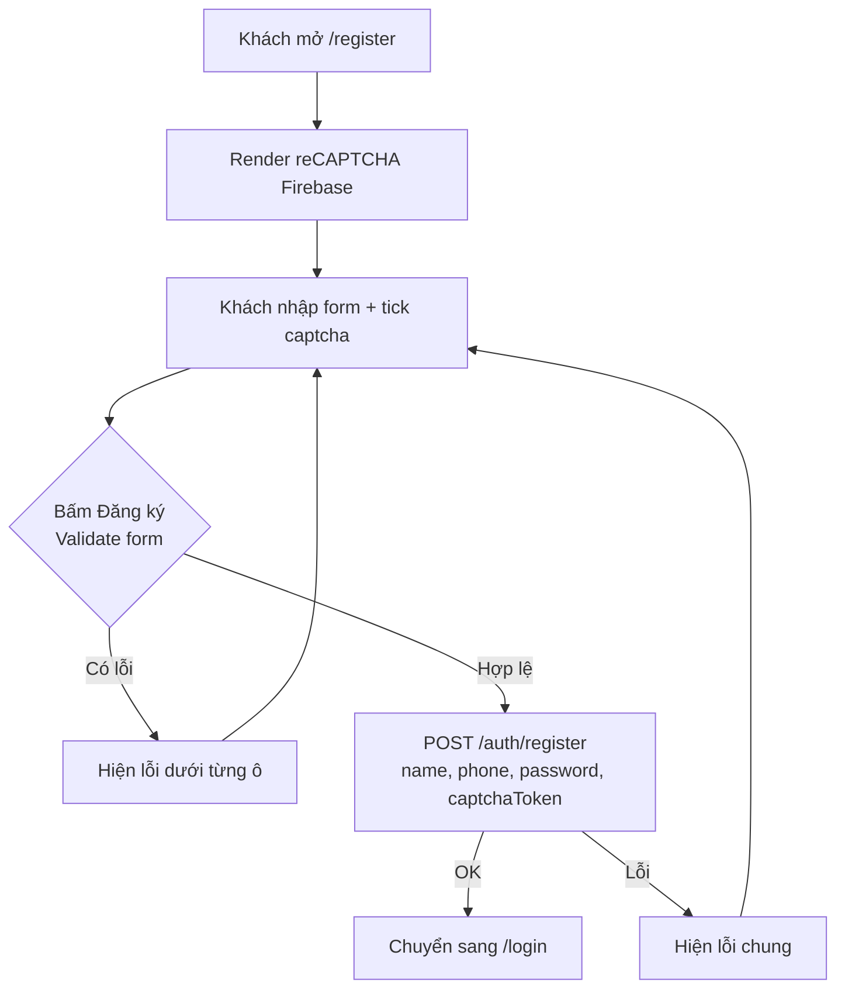

# Đăng ký tài khoản (Register)

- Cập nhật: 2026-09-30
- Route: `/register`
- Phạm vi: khách hàng tự tạo tài khoản bằng **họ tên + số điện thoại + mật khẩu**, có xác thực "tôi không phải robot" (reCAPTCHA của Firebase).

---

## 1. Tóm tắt nhanh

| Mục | Giá trị |
|---|---|
| Trang | `/register` |
| Vào từ đâu | Nút **Đăng ký** trên Header (desktop + mobile), link **Đăng ký ngay** ở trang `/login` |
| API gọi | `POST {NEXT_PUBLIC_API_APP}/auth/register` |
| Cần đăng nhập? | Không (`isUseAuth: false`) |
| Thành công | Chuyển sang `/login` để khách đăng nhập |
| Thất bại | Hiện lỗi chung "Đăng ký thất bại, vui lòng thử lại" |
| SEO | `noindex, nofollow` (Google không index trang này) |

---

## 2. Giao diện gồm những gì

1. Tiêu đề + mô tả ngắn
2. Ô **Họ tên**
3. Ô **Số điện thoại**
4. Ô **Mật khẩu** (có nút con mắt để ẩn/hiện)
5. Ô **Xác nhận mật khẩu** (có nút con mắt để ẩn/hiện)
6. Khung **reCAPTCHA** "Tôi không phải robot"
7. Nút **Đăng ký** (hiện loading khi đang gửi)
8. Link **Đã có tài khoản? Đăng nhập ngay** → `/login`

Toàn bộ chữ trên giao diện lấy từ file ngôn ngữ (`vn.json` / `en.json`), nhóm key `auth.register.*`.

---

## 3. Luồng xử lý



Chi tiết từng bước:

1. **Mở trang:** component `HumanVerification` tạo `RecaptchaVerifier` của Firebase và vẽ khung captcha.
2. **Tick captcha:** Firebase trả về `captchaToken`, trang lưu lại token này. Khi captcha hết hạn thì token bị xóa và khách phải tick lại.
3. **Bấm Đăng ký:** trang kiểm tra form theo bảng ở mục 4. Nếu có lỗi thì hiện ngay dưới ô tương ứng và dừng lại.
4. **Gửi API:** gọi `registerAction` → `AuthService.register` → `POST /auth/register` với body:
   ```json
   {
     "name": "Nguyễn Văn A",
     "phone": "0901234567",
     "password": "******",
     "captchaToken": "<token từ reCAPTCHA>"
   }
   ```
5. **Kết quả:**
   - Thành công: dùng `router.replace('/login')` để chuyển sang trang đăng nhập. Nút Back không quay lại form đăng ký.
   - Lỗi (bất kỳ mã HTTP nào khác 2xx): hiện câu `auth.register.error`.

---

## 4. Quy tắc kiểm tra dữ liệu (validate)

| Ô | Điều kiện | Thông báo lỗi (key) |
|---|---|---|
| Họ tên | Không được để trống (bỏ khoảng trắng) | `common.required` — "Bắt buộc" |
| Số điện thoại | Không được để trống | `booking.validation.phoneRequired` |
| Số điện thoại | Phải là số hợp lệ theo chuẩn VN (thư viện `libphonenumber-js`) | `booking.validation.phoneInvalid` |
| Mật khẩu | Không được để trống | `common.required` |
| Mật khẩu | Tối thiểu 6 ký tự | `auth.register.passwordMin` ⚠️ xem mục 7 |
| Xác nhận mật khẩu | Không được để trống | `common.required` |
| Xác nhận mật khẩu | Phải trùng với mật khẩu | `auth.register.passwordMismatch` |
| Captcha | Phải tick "Tôi không phải robot" | `auth.register.captchaRequired` |

---

## 5. File liên quan

| File | Vai trò |
|---|---|
| `app/register/page.tsx` | Giao diện form, state, validate, submit |
| `app/register/layout.tsx` | Metadata của trang (title, `noindex`) |
| `app/register/actions.ts` | Hàm `registerAction`, chỉ gọi lại `AuthService.register` |
| `services/auth/index.ts` | `AuthService.register()` gọi API `/auth/register` |
| `services/auth/type.ts` | Kiểu dữ liệu `Auth` (token) mà API trả về |
| `config/baseApi.ts` | Lớp `BaseAPI`: ghép URL, gắn header, ném lỗi khi HTTP không OK |
| `components/HumanVerification/index.tsx` | Khung reCAPTCHA (Firebase `RecaptchaVerifier`) |
| `config/firebase.ts` | `getFirebaseAuth()` dùng cho reCAPTCHA |
| `utils/phone.ts` | `formatPhoneToE164()` kiểm tra số điện thoại hợp lệ |
| `public/assets/language/vn.json`, `en.json` | Text giao diện, nhóm `auth.register.*` |
| `components/Header/index.tsx`, `app/login/page.tsx` | Chứa link dẫn tới `/register` |

---

## 6. Dữ liệu API trả về

Khi thành công, API trả về `data` gồm token và thông tin user:

```ts
{
  accessToken: string
  refreshToken: string
  accessExpire: string
  refreshExpire: string
  user: User
}
```

> Hiện tại client **không dùng** dữ liệu này, tức là không lưu token và không tự đăng nhập. Khách phải đăng nhập lại ở `/login`.

---

## 7. Lưu ý & vấn đề đã biết

Các điểm dưới đây là hiện trạng code, **chưa sửa**. Team cần quyết định có xử lý hay không.

1. **Lỗi validate mật khẩu < 6 ký tự:** trang có hiện lỗi `passwordMin`, nhưng **không chặn gửi form** (thiếu `isValid = false`). Vì vậy mật khẩu ngắn vẫn được gửi lên server.
2. **Số điện thoại gửi lên chưa chuẩn hóa:** `formatPhoneToE164` chỉ dùng để kiểm tra hợp lệ, còn giá trị gửi lên API là **đúng như khách gõ** (ví dụ `090 123 4567` hoặc `+84901234567`). Server cần tự chuẩn hóa, nếu không cùng một số có thể bị lưu thành nhiều dạng khác nhau.
3. **Không phân biệt loại lỗi:** mọi lỗi (trùng số điện thoại, captcha sai, server lỗi…) đều hiện chung một câu "Đăng ký thất bại". `BaseAPI` chỉ ném `HTTP error! status: xxx`, nên thông báo lỗi từ server bị mất.
4. **Không tự đăng nhập sau khi đăng ký:** API đã trả token nhưng client bỏ qua (xem mục 6).
5. **Chưa đúng rule dự án (AGENTS.md):**
   - `app/register/layout.tsx` đang viết cứng title `'Đăng ký'` (vi phạm rule 1: không viết text thẳng vào UI).
   - Route `'/login'`, số `6` (độ dài mật khẩu tối thiểu) và `auth.languageCode = 'vi'` trong `HumanVerification` đang viết thẳng, chưa qua constant (vi phạm rule 2).
6. **reCAPTCHA luôn hiện tiếng Việt:** do đặt cứng `languageCode = 'vi'`, không đổi theo ngôn ngữ khách đang chọn.
7. **`actions.ts` không phải Server Action:** file này không có `'use server'` nên thực chất chạy ở trình duyệt. Nó chỉ là hàm bọc lại `AuthService.register`.
8. **Key ngôn ngữ chưa dùng:** `auth.register.submitting`, `otpHint`, `captchaLabel`, `successTitle`, `successDesc`, `goToLogin` có trong `vn.json` nhưng trang không dùng. Có thể đây là phần còn sót từ flow OTP / màn hình thành công trước đây.

---

## 8. Cách test thủ công

1. Chạy `npm run dev` rồi mở `http://localhost:3000/register`.
2. Bấm **Đăng ký** khi form trống → mọi ô và captcha phải báo lỗi.
3. Nhập số điện thoại sai (ví dụ `123`) → báo "Số điện thoại không hợp lệ".
4. Nhập 2 mật khẩu khác nhau → báo "Mật khẩu không khớp".
5. Nhập đúng hết, tick captcha, bấm **Đăng ký** → chuyển sang `/login`.
6. Đăng ký lại đúng số điện thoại vừa dùng → báo "Đăng ký thất bại, vui lòng thử lại".
7. Đổi ngôn ngữ sang English → text trên form phải đổi theo (trừ khung captcha, xem mục 7.6).
